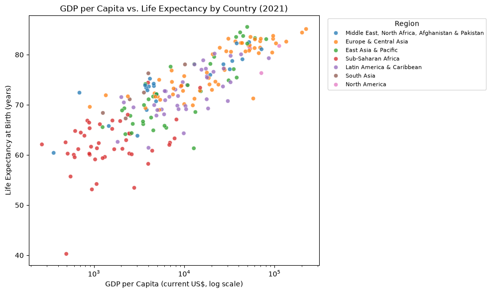
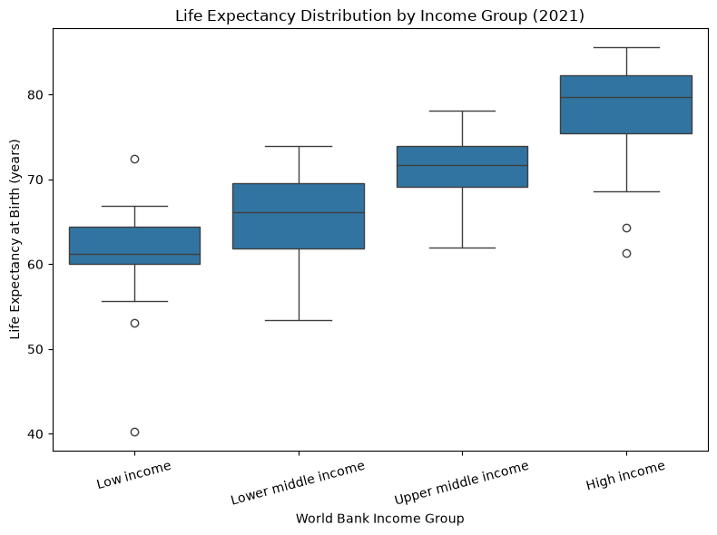

This section documents my data science projects, research questions, and data stories I create throughout the semesters.

---
## Project 1: Does National Wealth Predict Health?
**GDP per Capita and Life Expectancy Across Countries**

**Research question:** Is a country's GDP per capita associated with life expectancy at birth, and does this relationship differ across income groups and world regions?

Using the World Bank API, I pulled GDP per capita and life expectancy data for 2021 across 210 countries, cleaned it (including catching a data-quality bug where some World Bank aggregate entities share a blank country code), and explored the relationship between national wealth and health outcomes — the "Preston curve." The analysis finds that wealth buys a lot of health at low income levels, but the relationship flattens out sharply at higher income levels.

**[View the full notebook on GitHub →](https://github.com/lbouromm-sketch/Data-Science-Portfolio/blob/main/projects/gdp-life-expectancy.ipynb)**

The notebook includes the full write-up: problem definition, data description, cleaning steps, visualizations with insights, storytelling, limitations and ethics discussion, and academic references.
