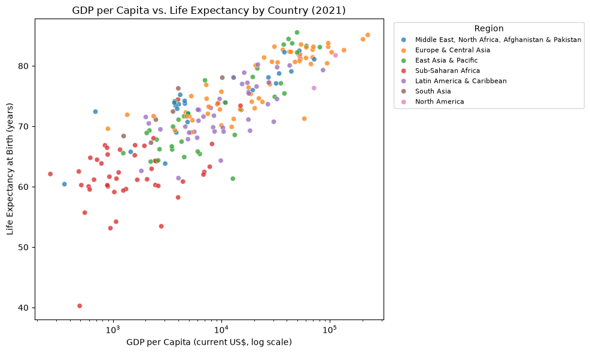
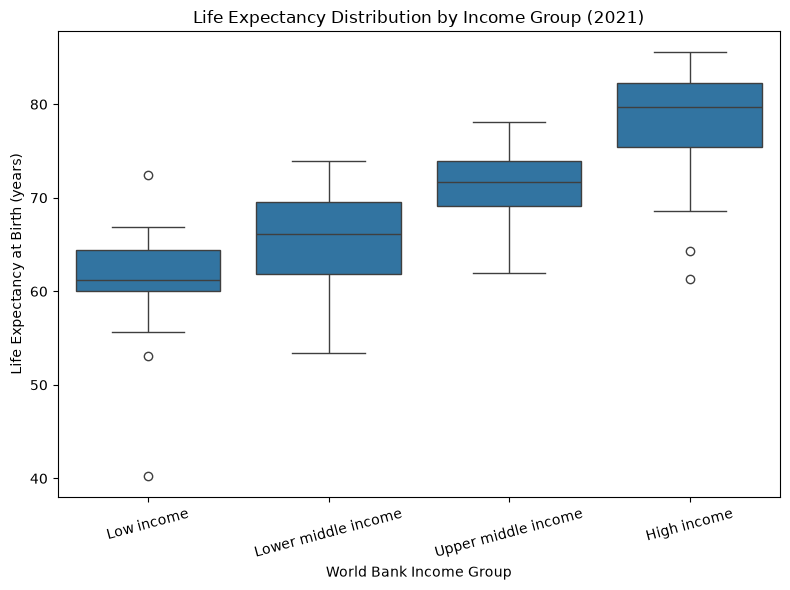
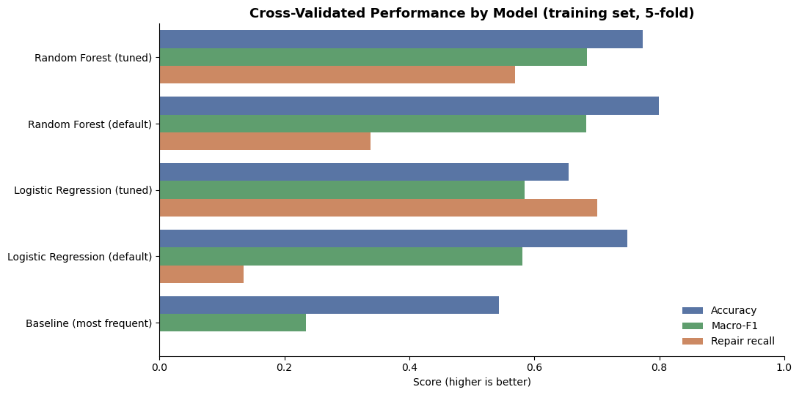

This section documents my data science projects, research questions, and data stories I create throughout the semesters.

---
## Project 1: Does National Wealth Predict Health?
**GDP per Capita and Life Expectancy Across Countries**

**Research question:** Is a country's GDP per capita associated with life expectancy at birth, and does this relationship differ across income groups and world regions?

Using the World Bank API, I pulled GDP per capita and life expectancy data for 2021 across 210 countries, cleaned it, and explored the relationship between national wealth and health outcomes — the "Preston curve." The analysis finds that wealth buys a lot of health at low income levels, but the relationship flattens out sharply at higher income levels.

**[View the full notebook on GitHub →](https://github.com/lbouromm-sketch/Data-Science-Portfolio/blob/main/projects/gdp-life-expectancy.ipynb)**

The notebook includes the full write-up: problem definition, data description, cleaning steps, visualizations with insights, storytelling, limitations and ethics discussion, and academic references.

---
## Project 2: Predicting Water Point Functionality
**Classifying the Condition of Water Points in Tanzania**

**Research question:** What factors contribute the most to the functionality of a public water point, and can a water point's condition be predicted to make infrastructure maintenance more proactive?

Using data from the DrivenData *Pump it Up* competition (collected by Taarifa and the Tanzanian Ministry of Water), I built classification models for 59,400 Tanzanian water points to predict whether each is functional, functional but needs repair, or non-functional. Because only about 7% of points need repair, I judged models on macro-F1 and per-class recall rather than accuracy. A tuned, class-balanced Random Forest (macro-F1 of 0.683) clearly outperformed both a do-nothing baseline (0.235) and Logistic Regression (0.588), and it catches 58% of the points needing repair, compared with 33% for the default forest. The analysis also shows that the amount of water a point yields is a strong signal, and it discusses the limits of the data, which is a 2002–2013 snapshot.

**[View the full notebook on GitHub →](https://github.com/lbouromm-sketch/Data-Science-Portfolio/blob/main/projects/tanzania-waterpoint-ML-classification.ipynb)**

The notebook includes the full write-up: problem definition, background, data exploration, preparation, model development and tuning, evaluation, interpretation, limitations and ethics, and references.
